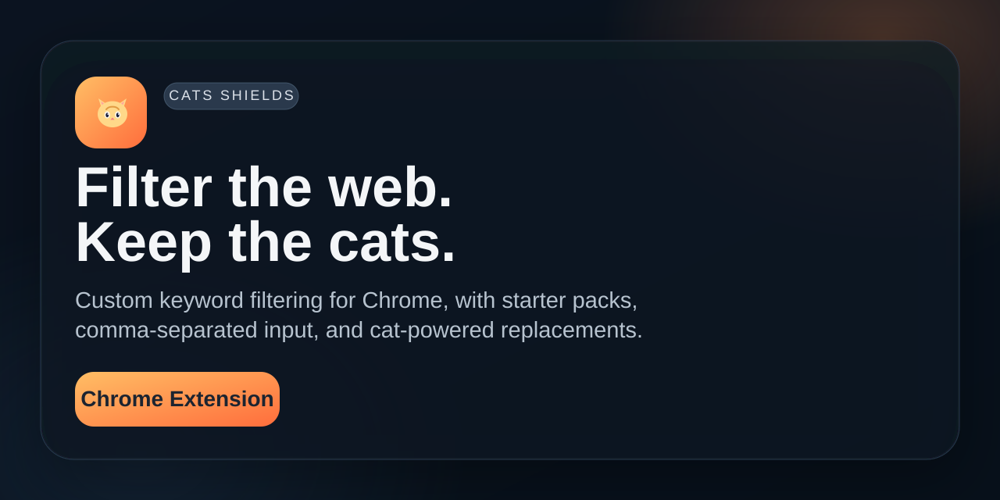

# Cats Shields

Filter the web. Keep the cats.




Chrome extension (Manifest V3) that replaces keyword-matched images with bundled local cat photos.

## Stack

- Vanilla JavaScript (no build step)
- Chrome Extension APIs: `storage`, `tabs`, `webNavigation`, content scripts, service worker
- Local JPG assets in `cats/`

## Quick setup

1. Clone this repository.
2. Open `chrome://extensions`.
3. Enable **Developer mode**.
4. Click **Load unpacked** and select this folder.

## Required assets

- `icons/icon-*.png` generated from `icons/icon.svg`
- `cats/cat_01.jpg` … `cats/cat_60.jpg` bundled replacement images

## Environment variables

None. Keywords are stored in `chrome.storage.sync`.

## Commands

Load the folder directly in Chrome. No install or build required.

Regenerate icon PNGs from the SVG:

```bash
magick -background none icons/icon.svg -resize 16x16 icons/icon-16.png
magick -background none icons/icon.svg -resize 32x32 icons/icon-32.png
magick -background none icons/icon.svg -resize 48x48 icons/icon-48.png
magick -background none icons/icon.svg -resize 128x128 icons/icon-128.png
```

## Usage

1. Open the popup and choose a starter pack.
2. Click **Apply pack** to save keywords instantly, or **Paste pack** to edit before adding.
3. Add custom keywords with comma-separated input.
4. Browse pages — matched images are replaced with cats automatically.
5. The block count appears on the extension icon badge (per tab, resets on navigation).

Starter packs: Arachnophobia, Snakes, Insects, Clowns, Sharks, Needles.

## Architecture

```text
manifest.json
├── defaults.js      shared constants, preset packs, keyword/storage helpers
├── background.js    service worker — tab badge and navigation generation
├── content.js       page scanning, DOM context matching, image replacement
├── popup.html/css/js keyword management UI
├── cats/            local replacement images
└── icons/           extension branding assets
```

**Keyword merge:** only user keywords are persisted in `chrome.storage.sync`; runtime list uses `mergeActiveKeywords()` (`DEFAULT_KEYWORDS` + user list).

**Matching:** direct match on `src`, `alt`, lazy-load attributes, and surrounding card context (headings, links, Google result metadata). Text is URI-decoded and accent-normalized before comparison.

**Safety:** skips profile avatars, `/@` profile links, favicons, and images smaller than 48×48 px unless they match directly.

**Block badge:** `content.js` sends absolute counts to `background.js`; navigation bumps a per-tab generation counter via `webNavigation` so stale messages from the previous page are ignored.

**Performance:** mutation observer batched with `requestAnimationFrame`; stable cat assignment per media key via `data-cat-url`.

## Permissions

| Permission | Reason |
|---|---|
| `storage` | Persist custom keywords |
| `tabs` | Per-tab badge state |
| `webNavigation` | Reset block count on navigation |
| `<all_urls>` | Run content script and load cat assets on visited pages |

## Privacy

Runs locally. No backend, analytics, or external image APIs at runtime.

## License

MIT — see [LICENSE](LICENSE).
