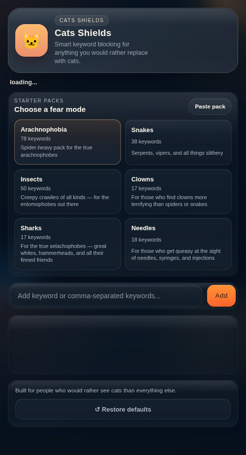

# Cats Shields 🐱

Turn unwanted browsing moments into a much more civilized cat experience.



Cats Shields is a Chrome extension that detects keyword-matched images and swaps them with bundled local cat photos. It works on direct image matches and also on card-based layouts where the image itself looks neutral but the surrounding title or link clearly points to content you want filtered.

## Why This Exists

Some people want fewer specific things on the internet. This extension solves that problem with the only reasonable replacement: cats.

## Highlights

- Replaces keyword-matched images with local bundled cat photos
- Detects matches through image URLs, alt text, titles, and lazy-load attributes
- Understands card context, so it can catch matching posts even when the image URL is generic
- Supports editable keywords through the popup UI
- Persists custom keywords with `chrome.storage.sync`
- Ships with local assets only, with no runtime dependency on external image services
- Avoids false positives on profile avatars and username links

## Demo Behavior

The extension can replace images when it finds terms from your keyword list, such as:

- Direct image metadata like `spider`, `tarantula`, or any custom keyword you add
- Card titles that reference matching content
- Internal card links that contain keyword-related slugs

This makes it useful on gallery, marketplace, and discovery pages where the image source alone is not enough.

## Installation

1. Clone or download this repository.
2. Open Chrome and go to `chrome://extensions`.
3. Enable `Developer mode`.
4. Click `Load unpacked`.
5. Select this project folder.

## Usage

1. Visit any page that contains content matched by your keyword list.
2. Click the extension icon.
3. Add or remove keywords in the popup.
4. Reload the page if needed.

The popup merges saved keywords with the defaults from `defaults.js`, so new default keywords still apply after updates.

You can add one keyword at a time or paste multiple keywords separated by commas.

Example:

```text
snake, snakes, serpent, cobra
```

The popup also includes clickable starter packs.

You can select a preset in the popup and click `Paste pack` to load its full comma-separated keyword list into the input field before saving it.

Current built-in starter packs include:

- Arachnophobia
- Snakes
- Insects
- Clowns
- Sharks
- Needles

You can use a preset as-is, edit it before saving, or mix it with your own custom keywords.

## Project Structure

- `manifest.json`: Chrome Extension Manifest V3 configuration
- `defaults.js`: shared default keyword list
- `content.js`: keyword detection and image replacement logic
- `popup.html`: popup layout
- `popup.css`: popup styling
- `popup.js`: popup interactions and keyword management
- `cats/`: bundled cat images used for replacement
- `icons/`: extension icon assets

## Permissions

- `storage`: stores custom keywords
- `<all_urls>`: lets the content script run on the pages you open

## Privacy

This extension works locally in the browser.

- No backend
- No analytics
- No external API calls required at runtime for image replacement

## Development Notes

- Built for Chromium-based browsers with Manifest V3 support
- Uses `chrome.runtime.getURL()` to load local cat images
- Uses DOM context detection to identify matching cards more accurately
- Default keywords live in `defaults.js`

## License

This project is licensed under the MIT License. See the `LICENSE` file for details.
